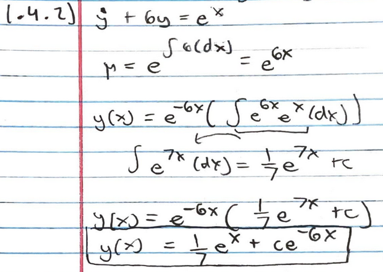

# diffeq

## First Order Differential Equations

### Integrating Factor Method for Differential Equations

**Introduction**
Consider a first order linear differential equation that takes the following form where p(t) and g(t) are any arbitrary functions with respect to the dependendent variable. 
$$\frac{dy}{dt} + p(t)y = g(t)$$
For any of the following methods to work the functions p(t) and g(t) must also be continuous. A linear differential equation is the most common form of a differential equation and we will use the integration factor method to solve it.

Assume some magical function $\mu(t)$ called the integrating factor and multiply it through the equation.
$$\mu(t) \frac{dy}{dt} + \mu(t)p(t)y = \mu(t)g(t)$$
Assume the following is true
$$\mu(t)p(t) = \dot{\mu}(t)$$
Subbing in the our new assumption into our original differential equation.
$$\mu(t)\frac{dy}{dt} + \dot{\mu}(t)y = \mu(t)g(t)$$
We can recognize that the left side of the equation is the just the product rule. This allows us to rewrite the equation as the following:
$$\frac{d}{dt}(\mu (t) y(t)) = \mu(t)g(t)$$
We can integrate through this equation to get this next equation:
$$\mu(t)y(t) + c = \int \mu(t)g(t)(dt)$$
Solving for y(t) we get:
$$y(t) = \frac{\int \mu(t)g(t)(dt)}{\mu(t)}$$
Go back to our initial assumption and solve for p(t):
$$\mu(t)p(t) = \dot{\mu}(t)$$
$$p(t) = \frac{\dot{\mu}(t)}{\mu(t)}$$
Again you might recognize that the right side of the equation is the definition of a the derivative natural logarithim ($\frac{d}{dx}ln(u) = \frac{du}{dx}\frac{1}{u}:$)
\frac{d}{dt}ln(\mu(t)) = p(t)
Now integrating both sides and manipulating a little we get:
$$ln(\mu (t)) = \int P(t)(dt) + k$$
$$\mu(t) = ke{\int P(t)(dt)}$$
Plugging are formula into our equation for y(t) we get:
$$y(t) = \frac{k \int e^{\int p(t)(dt)} g(t)(dt) + c}{ke^{\int p(t)(dt)}}$$
Dividing through by k to reduce the equation to a single equation we get the final formula of:
$$y(t) = \frac{1}{\mu(t)}(\int \mu(t) g(t)dt + c)$$
$$\mu(t) = e^{\int p(t)(dt)}$$

**Problems with Solutions**
Question 1.4.2:  $\dot{y} + 6y = e^{x}$

  
Visualization

  
Solution

  

  

Question 1.4.4:  $\dot{y} + cos(x)y = cos(x)$

  
Visualization

  
Solution

Question 1.4.10:  $\dot{y}+ 3x^{2}y = x^{2}$

  
Visualization

  
Solution

Question 1.4.11:  $\dot{y} + 2sin(2x)y = 2sin(2x) \quad y(\pi/2) = 3$

  
Visualization

  
Solution

### Exact Equations
Exact functions are an extremely common form of differential equation. An exact equation is a type of potential function. Potential functions model so many things like the gravitational potential energy and electrostatic potential energy. A certain potential functions f(x,y) must obey a certain set of properties.

Remember that $g = \nabla f$  where f is the potential function of g. If g has a potential function (and not all functions have potential functions) then it is conservative. A conserative function implies that the potential function itself $\vec{F} = p\vec{i} + q\vec{j}$ has the following property:
$$\frac{\partial p}{\partial y} = \frac{\partial Q}{\partial x} $$

In order for the following methods to be applied the previous property must be true and the differential equation must take the form of:
$$P(x,y)dx + Q(x,y)dy = 0$$
Alternatively,
$$\frac{\partial F}{\partial x}(dx) + \frac{\partial F}{\partial y}(dy)=0$$

Question 1.8.1.a:  $(2xy+x^{2})dx + (x^{2}+y^{2}+1)dy = 0$

  
Visualization

  
Solution

Question 1.8.1.b:  $x(dx) + y(dy) = 0$

  
Visualization

  
Solution

Question 1.8.1.c:  $(e^{x}+y^{3})dx + 3xy^2(dy) = 0$

  
Visualization

  
Solution

Question 1.8.1.d:  $(x+y)cos(x) + sin(x) + sin(x)\frac{dy}{dx} = 0$

  
Visualization

  
Solution

Question 1.8.7:  $(3x^{2}+3y)dx+(3y^2+3x)dy = 0$

  
Visualization

  
Solution

